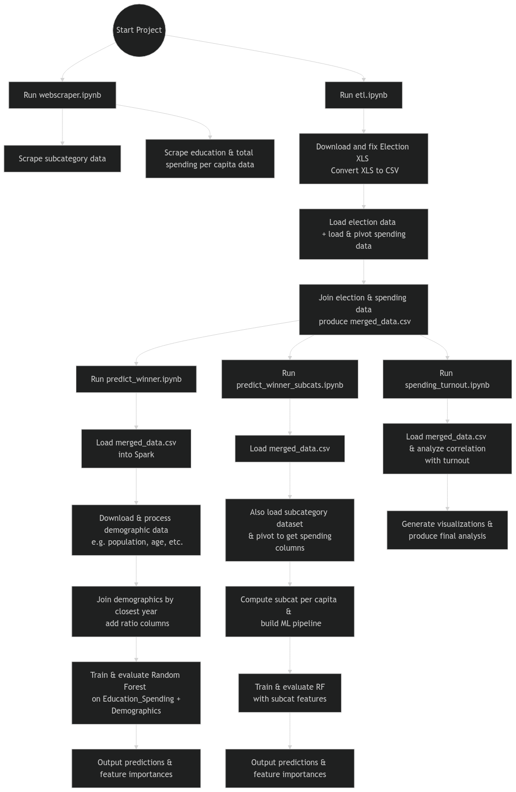

### Municipal Spending and Election Analysis Project

This project analyzes municipal education spending and election outcomes in Upper Austria scalably using Apache Spark. The goal is to understand the relationship between public spending, voter turnout, and election results. We predict election winners using machine learning models and analyze factors influencing political outcomes.

**Project Structure**
- webscraper.ipynb: Scrapes municipal spending data from a government website.
- etl.ipynb: Extracts, transforms, and merges election and spending data into a clean dataset.
- predict_winner.ipynb: Uses Spark ML to predict election winners based on total education spending and demographics.
- predict_winner_subcats.ipynb: Predicts winners using subcategory-level spending instead of total spending.
- spending_turnout.ipynb: Analyzes the relationship between public spending and voter turnout.

**Data Sources**
- Municipal education spending: Scraped from public government websites using `webscraper.ipynb`.
- Election results: **TODO**
- Demographics (age, nationality, education levels): Downloaded from data.gv.at in `predict_winner.ipynb`.

**How to Run**
- Optional: Run `webscraper.ipynb` to scrape spending data.
    - The data is already saved, so running it is optional.
    - It takes quite a bit of time for the script to finish.
- Run etl.ipynb to clean and merge datasets.
- Run prediction notebooks (predict_winner.ipynb, predict_winner_subcats.ipynb).
- Run spending_turnout.ipynb for further analysis.

**Notes**
- Data is stored in the data folder.
- The pipeline is scalable and designed to handle large datasets.

